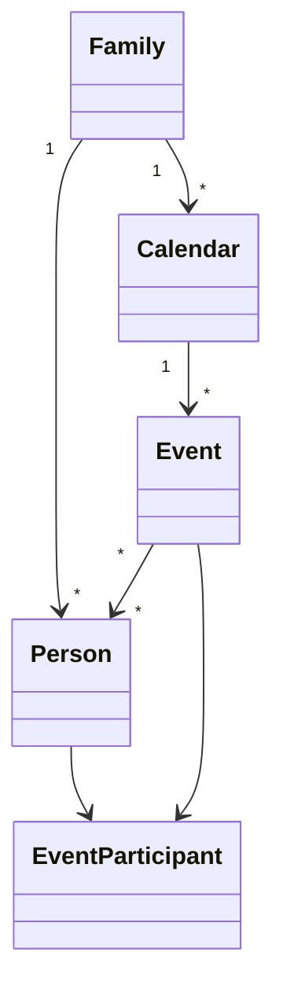

# 16 – SwiftData Database Design

**Projekt:** Boholts Family Platform

**Version:** 1.0

**Status:** Design Approved

**Dokumentejer:** Nicolaj Bach Boholt / ChatGPT

**Sidst opdateret:** Juli 2026

---

# Formål

Dette dokument beskriver den komplette databasestruktur for **Boholts Family Platform**.

Datamodellen danner fundamentet for hele applikationen og skal kunne understøtte både Proof of Concept, MVP og fremtidige versioner uden større omskrivninger.

Datamodellen er designet efter følgende principper:

- Offline First
- SwiftData som primær database
- MVVM Architecture
- Lokal data er "Single Source of Truth"
- Cloud synkronisering sker via Services
- Understøtter flere kalenderkilder
- Understøtter AI-funktioner i fremtiden

---

# Overordnet arkitektur

```
                Google Calendar
                       │
                Apple Calendar
                       │
                Outlook Calendar
                       │
             Calendar Services
                       │
                 Sync Engine
                       │
────────────────────────────────────
              SwiftData
────────────────────────────────────
        Family
        Person
        Calendar
        Event
        EventParticipant
        Settings
────────────────────────────────────
                SwiftUI
```

SwiftData er den eneste database som UI arbejder imod.

Ingen Views må kommunikere direkte med Google Calendar.

Al ekstern kommunikation sker gennem Services.

---

# Databaseprincipper

## 1. Offline First

Alle ændringer gemmes lokalt først.

Eksempel:

Bruger opretter en aftale

↓

SwiftData gemmer

↓

UI opdateres

↓

Sync Engine sender senere til Google

Dette giver:

- Hurtig brugeroplevelse
- App virker uden internet
- Ingen ventetid

---

## 2. Immutable ID

Alle objekter får et UUID.

Eksempel

Family

```
A12D34E5...
```

Person

```
7CC5B...
```

Event

```
9A772...
```

Disse ID'er ændres aldrig.

---

## 3. Soft Delete

Objekter slettes ikke straks.

I stedet markeres de

```
isDeleted = true
```

Dette gør synkronisering langt mere sikker.

---

## 4. Sync Metadata

Alle objekter får metadata.

Eksempel

```
createdAt

updatedAt

lastSynced

source

version

syncStatus
```

Dette bruges af Sync Engine.

---

# Primære modeller

Databasen består af seks kerneobjekter.

```
Family

↓

Person

↓

Calendar

↓

Event

↓

EventParticipant

↓

Settings
```

---

# Family

En Family repræsenterer én familie.

Eksempel

```
Boholt Familien
```

Der findes kun én aktiv familie i POC.

Senere kan appen understøtte flere.

---

## Felter

| Felt | Type | Beskrivelse |
|------|------|-------------|
| id | UUID | Primær nøgle |
| name | String | Familienavn |
| createdAt | Date | Oprettet |
| updatedAt | Date | Sidst ændret |

---

## Relationer

En Family har:

```
1

↓

Mange Personer

↓

Mange Kalendere

↓

Mange Events
```

---

# Person

Person er en af de vigtigste modeller.

Den repræsenterer alle familiemedlemmer.

Eksempel

```
Nicolaj

Christine

Alfred

Jens
```

---

## Felter

| Felt | Type |
|------|------|
| id | UUID |
| firstName | String |
| lastName | String |
| displayName | String |
| birthday | Date? |
| color | String |
| avatar | String? |
| role | PersonRole |
| isActive | Bool |

---

## PersonRole

```swift
enum PersonRole {

case adult

case child

}
```

---

## Designprincip

Vi bruger enum fremfor tekst.

Ikke

```
"Adult"

"Child"
```

men

```
.adult

.child
```

Dette giver:

- færre fejl

- hurtigere kode

- compile-time sikkerhed

---

## Farver

Farven gemmes som systemnavn.

Eksempel

```
blue

green

orange

purple

pink
```

Senere kan brugeren vælge frit.

---

## Avatar

POC bruger SF Symbols.

Eksempel

```
person.fill

person.circle.fill

figure.and.child.holdinghands
```

Senere kan egne billeder vælges.

---

# Calendar

Calendar repræsenterer én kalender.

Eksempel

```
Nicolaj

Christine

Familie

Skole

Arbejde
```

---

## Hvorfor egen Calendar-model?

Google Calendar arbejder med kalendere.

Apple Calendar arbejder med kalendere.

Outlook arbejder med kalendere.

Derfor gør vi også.

Det gør integrationen langt lettere.

---

## Felter

| Felt | Type |
|------|------|
| id | UUID |
| title | String |
| color | String |
| source | CalendarSource |
| owner | Person? |
| isShared | Bool |

---

## CalendarSource

```swift
enum CalendarSource {

case google

case apple

case outlook

case internal

}
```

---

## Shared Calendar

Eksempel

```
Familie
```

```
isShared = true
```

Personlige kalendere

```
Nicolaj

Christine
```

```
isShared = false
```

---

# Designbeslutning

Alle events tilhører altid én kalender.

Ikke én person.

Personer tilføjes som deltagere.

Dette følger Google Calendars design og gør synkronisering væsentligt lettere.

---

# Næste del

I del 2 beskrives:

- Event-modellen
- EventParticipant
- Settings
- Sync Metadata
- Relationer
- Mermaid-diagrammer
- Database Rules
- Performance
- Fremtidige udvidelser
- Implementeringsnoter til SwiftData
---

# Event

Event er den centrale model i hele applikationen.

Alt hvad brugeren ser i kalenderen er et Event.

Eksempler:

- Arbejde
- Børnehave
- Skole
- Fodbold
- Tandlæge
- Ferie
- Fødselsdag
- Møde
- Indkøb
- Middag

---

## Felter

| Felt | Type | Beskrivelse |
|------|------|-------------|
| id | UUID | Primær nøgle |
| title | String | Titel |
| description | String | Beskrivelse |
| location | String? | Lokation |
| startDate | Date | Start |
| endDate | Date | Slut |
| allDay | Bool | Heldagsbegivenhed |
| color | String | Visningsfarve |
| calendar | Calendar | Kalender |
| createdAt | Date | Oprettet |
| updatedAt | Date | Ændret |
| lastSynced | Date? | Sidste synkronisering |
| syncStatus | SyncStatus | Status |

---

## SyncStatus

```swift
enum SyncStatus {

case local

case pending

case synced

case conflict

case failed

}
```

---

## Betydning

### local

Kun gemt lokalt.

---

### pending

Afventer upload.

---

### synced

Synkroniseret med ekstern kalender.

---

### conflict

To ændringer kolliderer.

---

### failed

Synkronisering fejlede.

---

# EventParticipant

Et Event kan have mange deltagere.

Eksempel

```
Sommerferie

↓

Nicolaj

Christine

Alfred

Jens
```

Derfor anvendes en separat relation.

---

## Felter

| Felt | Type |
|------|------|
| id | UUID |
| person | Person |
| event | Event |
| status | AttendanceStatus |

---

## AttendanceStatus

```swift
enum AttendanceStatus {

case accepted

case declined

case tentative

case unknown

}
```

---

# Settings

Settings gemmer lokale indstillinger.

Der findes kun én Settings-instans.

---

## Felter

| Felt | Type |
|------|------|
| id | UUID |
| preferredView | CalendarViewType |
| firstWeekday | Int |
| enableNotifications | Bool |
| enableHaptics | Bool |
| darkMode | Bool |
| language | String |

---

# CalendarViewType

```swift
enum CalendarViewType {

case day

case week

case month

case agenda

}
```

---

# Relationer

```
Family

│

├───────────────┐

│               │

Person       Calendar

│               │

└──────┐        │

       │        │

       ▼        ▼

     EventParticipant

             │

             ▼

           Event
```

---

# Samlet datamodel



---

# Designprincipper

## 1. Ingen duplikerede data

Data eksisterer kun ét sted.

Eksempel

Forkert:

```
Person navn

↓

gemmes i Event
```

Korrekt:

```
Event

↓

Person reference
```

---

## 2. UUID overalt

Alle objekter identificeres med UUID.

Fordele

- sikker synkronisering
- ingen konflikter
- understøtter offline

---

## 3. UTC tid

Alle datoer gemmes i UTC.

UI konverterer automatisk til lokal tidszone.

---

## 4. Ingen forretningslogik i modeller

Modellerne indeholder kun data.

Alt logik placeres i:

- Services
- ViewModels

---

# Performance

SwiftData forventes at håndtere:

- 100 familiemedlemmer
- 50 kalendere
- 100.000 events

uden mærkbar forringelse.

---

# Indeksering

Følgende felter skal kunne søges effektivt:

- startDate
- endDate
- person
- calendar
- syncStatus

---

# Synkronisering

SwiftData er altid den primære database.

Flow:

```
Google

↓

Sync Engine

↓

SwiftData

↓

SwiftUI
```

UI arbejder aldrig direkte mod Google Calendar.

---

# Fejlhåndtering

Hvis synkronisering mislykkes:

1. Event gemmes lokalt.
2. Status sættes til `failed`.
3. Brugeren informeres.
4. Automatisk nyt forsøg foretages senere.

Ingen data må gå tabt.

---

# Fremtidige modeller

Datamodellen er forberedt til senere udvidelser.

Planlagte modeller:

- Task
- ShoppingItem
- MealPlan
- Budget
- Document
- Vehicle
- Pet
- Chore
- Notification
- Attachment
- AIConversation
- Reminder
- Travel
- Vacation
- Contact

Disse kan tilføjes uden at ændre de eksisterende kernemodeller.

---

# Databaseprincipper

Projektet følger disse grundregler:

- Offline First
- Single Source of Truth
- UUID på alle objekter
- Soft Delete
- Versionsstyring
- Automatisk synkronisering
- Ingen direkte API-kald fra UI
- MVVM Architecture
- SwiftData som primær lagring

---

# Konklusion

Denne datamodel udgør fundamentet for hele **Boholts Family Platform**.

Designet er:

- skalerbart
- offline-først
- cloud-klar
- AI-klar
- udvideligt
- kompatibelt med Google Calendar, Apple Calendar og Outlook.

Den næste fase bliver implementeringen af disse modeller som SwiftData-klasser og opbygningen af den første fungerende prototype.

---

## Referencer

Relaterede dokumenter:

- 04 – Teknisk Arkitektur
- 08 – Development Plan
- 09 – Data Model
- 11 – Google Calendar Integration
- 14 – POC Sprint Plan
- 15 – Xcode Projektstruktur og Første Implementation
- 17 – UI Component Library