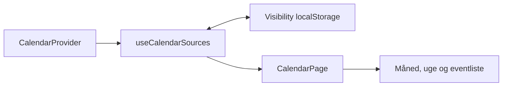

# 20 - Calendar Provider Architecture

**Projekt:** Boholts Family Platform

**Status:** Opdateret Sprint 20, Fase 5 (ADR-017) — se bunden af dokumentet.
Historiske sprint-sektioner nedenfor er bevaret for sporbarhed, men
"Nuværende dataflow" og "Provider-typerne" herunder er ajourført til
den faktiske, nuværende arkitektur.

**Dato:** 2026-07-28 (oprindelig), 2026-08-15 (sidst ajourført)

## Formål

Kalenderens React-lag arbejder mod en stabil, leverandøruafhængig kontrakt. Alle aftaler ejes af en ekstern kalenderudbyder (Google eller Outlook) — der findes intet lokalt/offline aftale-lag længere (fjernet Fase 5, se bunden).

## Nuværende dataflow

```text
CalendarPage og event-dialoger
        ↓
useCalendarEvents
        ↓
CompositeCalendarProvider
        ↓
   ┌────┴────┐
GoogleCalendarProvider   OutlookCalendarProvider
        ↓                        ↓
  /api/calendar          Microsoft Graph API
  (server-ejet          (klient-side, MSAL,
   refresh token,          kortlivet token
   ADR-017)                i hukommelsen,
                            ADR-016)
```

`CompositeCalendarProvider` samler de forbundne eksterne providere; en fejl i
én (fx en udløbet Outlook-session) skjuler ikke de andres data. Google er
altid til stede i listen, uanset forbindelsesstatus — dens egen
authentication-fejl (401) håndteres af composite-laget som "disconnected".

## Domænekontrakter

`CalendarProvider` tilbyder typede asynkrone operationer for kalenderkilder, events i et eksplicit interval og den CRUD-adfærd, som appen allerede bruger. `restoreEvent` er en eksplicit ekstra operation, fordi den eksisterende fortryd-sletning anvender den.

`CalendarSource` beskriver en kalenderkilde med intern identitet, navn, provider-type, farve, synlighed og read-only-status. `externalReference` er et valgfrit provider-lagsfelt; UI må ikke fortolke det som en Google- eller Apple-identitet.

Provider-typerne er `google`, `outlook` og `apple`. Google og Outlook er implementeret; Apple er en kontraktmæssig reservation uden implementation. `local` fandtes indtil Fase 5 (Sprint 20) — se bunden.

## Dependency injection

`calendarProviderFactory.ts` eksporterer appens ene, eksplicit valgte `calendarProvider`-instans. `useCalendarEvents` modtager samtidig en valgfri `CalendarProvider`-parameter. Produktionskald bruger standardinstansen, mens tests senere kan injicere en test-provider uden React Context, ny global state eller ændringer af UI-komponenternes props.

## Fejl

`CalendarProviderError` normaliserer provider-fejl til en begrænset kode: authentication, authorization, network, not-found, conflict, validation, unavailable eller unknown. Hver provider oversætter selv sine egne fejl til disse koder, så dialogernes `submitError`-flow er ens uanset kilde. Hooks og UI fortolker ikke rå provider- eller HTTP-fejl.

## Kalenderkilder og synlighed

`useCalendarSources` henter kilder gennem provideren. Brugerens lokale valg gemmes separat fra domænekilden under `boholts-family-calendar-source-visibility` som en JSON-liste af skjulte source IDs. Ugyldig JSON eller struktur falder tilbage til alle kendte kilder synlige; fjernede IDs ignoreres, og nye kilder er synlige som standard.



Filtreringen sker centralt i `CalendarPage`; dialogerne beholder det ufiltrerede event-sæt, så skjulte kalendere fortsat indgår i konfliktkontrol. Når alle kilder er skjult, vises en særskilt tom tilstand med handlingen “Vis alle kalendere”.

## Farver

`CalendarSource.color` er den autoritative farvekilde for kalenderevents — arvet fra det familiemedlem, kalenderen er tildelt (`calendarMemberMappingStorage.ts`, D1-ejet siden Fase 4, ADR-014).
## Sprint 11.1: Google Calendar som skrivebeskyttet kilde

Kalenderen kan sammensætte den eksisterende `LocalCalendarProvider` og en
valgfri `GoogleCalendarProvider` gennem `CompositeCalendarProvider`.
`CalendarEvent.sourceId` er den autoritative reference til en kalenderkilde:
lokale kilder bruger `local:<ownerId>`, og Google-kilder bruger
`google:<calendarId>`. `ownerIds` beskriver fortsat kun familiens personer;
Google-aftaler har derfor en tom deltagerliste.

Google-data er skrivebeskyttede og bruger namespacede event-id'er. Google
Calendar API- og OAuth-detaljer er afgrænset til provider-laget. UI'et bruger
kun generiske kalenderkilder og en forbindelsesstatus. OAuth-tokenet holdes
kun i hukommelsen. Eksisterende localStorage-aftaler uden `sourceId`
normaliseres i hukommelsen ud fra deres første deltager, uden migration eller
overskrivning af lagerdata.
## Sprint 12.1: Google Calendar write foundation

Google events routes via `sourceId` til Google provideren. Google sources er
kun skrivbare, når CalendarList `accessRole` er `owner` eller `writer`;
`reader`, `freeBusyReader` og ukendte værdier forbliver
skrivebeskyttede. Den centrale token-session bruger scopes
`calendar.events` og `calendar.calendarlist.readonly`, kun i memory.

## Sprint 20, Fase 1 (ADR-017): Google flytter server-side

Google-tokenet holdes ikke længere i klientens hukommelse. Login går gennem
et server-ejet OAuth 2.0 Authorization Code + PKCE-flow; den krypterede
refresh token gemmes i D1, og klienten taler kun med appens egen
`/api/calendar`-proxy. `GoogleCalendarProvider` er uændret i sin kontrakt
mod resten af kalender-laget — kun hvad der ligger *bag* den er skiftet ud.

## Sprint 20, Fase 5: det lokale lag fjernes helt

`LocalCalendarProvider`, `CalendarService`s localStorage-baserede event-CRUD
og demo-seed-dataen er fjernet. `CompositeCalendarProvider` sammensætter nu
udelukkende eksterne providere (Google, Outlook) — der er intet
`local:`-præfikset `sourceId` og ingen fallback-kalender for et
familiemedlem uden en tildelt ekstern kalender. `CalendarProviderType`
mistede `"local"`-varianten.

Baggrund: alle aftaler skal fra nu af leve i en ekstern, delt kalender
(Google/Outlook), ikke device-lokalt (jf. ADR-017, punkt 6, og Fase 4's
kalender-medlem-tildeling i D1). Ingen migrering var nødvendig — de
eksisterende lokale data var udelukkende demo-/testdata uden reel værdi.

Kendt, accepteret konsekvens: et familiemedlem uden en tildelt kalender har
ingen kalenderkilde overhovedet, før de tildeles én (Indstillinger →
"Rediger familiemedlem" → Kalender).

Create, update og delete mapper den generiske eventmodel til Googles event
resource. All-day end dates forbliver eksklusive. Der oprettes ikke attendees,
recurrence eller persistent login. PATCH bruges til update for at bevare
ukendte Google-felter, og `sendUpdates=none` bruges fordi attendee-support
ikke findes.
