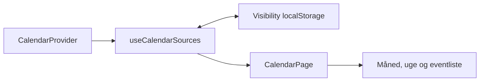

# 20 - Calendar Provider Architecture

**Projekt:** Boholts Family Platform

**Status:** Implementeret som web-arkitekturgrundlag i Sprint 10.1

**Dato:** 2026-07-28

## Formål

Kalenderens React-lag arbejder mod en stabil, leverandøruafhængig kontrakt. Den lokale/offline kalender forbliver standard, mens Google Calendar og Apple Calendar senere kan implementeres bag samme grænse.

## Nuværende dataflow

```text
CalendarPage og event-dialoger
        ↓
useCalendarEvents
        ↓
CalendarProvider
        ↓
LocalCalendarProvider
        ↓
CalendarService
        ↓
demo-data + localStorage
```

`CalendarService` bevarer ejerskabet over eksisterende storage-key, validering, sortering og localStorage-adfærd. `LocalCalendarProvider` er kun en adapter, så event- og kalender-id'er samt demo-data bevares.

## Domænekontrakter

`CalendarProvider` tilbyder typede asynkrone operationer for kalenderkilder, events i et eksplicit interval og den CRUD-adfærd, som appen allerede bruger. `restoreEvent` er en eksplicit ekstra operation, fordi den eksisterende fortryd-sletning anvender den.

`CalendarSource` beskriver en kalenderkilde med intern identitet, navn, provider-type, farve, synlighed og read-only-status. `externalReference` er et valgfrit provider-lagsfelt; UI må ikke fortolke det som en Google- eller Apple-identitet.

Provider-typerne er `local`, `google` og `apple`. Kun `local` er implementeret i Sprint 10.1.

## Dependency injection

`calendarProviderFactory.ts` eksporterer appens ene, eksplicit valgte `calendarProvider`-instans. `useCalendarEvents` modtager samtidig en valgfri `CalendarProvider`-parameter. Produktionskald bruger standardinstansen, mens tests senere kan injicere en test-provider uden React Context, ny global state eller ændringer af UI-komponenternes props.

## Fejl

`CalendarProviderError` normaliserer provider-fejl til en begrænset kode: authentication, authorization, network, not-found, conflict, validation, unavailable eller unknown. Den lokale adapter bevarer de eksisterende danske fejlbeskeder som `message`, så dialogernes nuværende `submitError`-flow fortsat virker. Hooks og UI fortolker ikke rå provider- eller HTTP-fejl.

## Google-forberedelse

Mappen `providers/google/` er alene en kontraktmæssig reservation. Der er ingen Google SDK, OAuth, API-kald, tokens, miljøvariabler eller simulerede Google-data i Sprint 10.1. En senere `GoogleCalendarProvider` skal oversætte eksterne data og fejl til de samme domæne- og provider-typer, før de forlader provider-laget.

## Kalenderkilder og synlighed

`useCalendarSources` henter kilder gennem provideren. Brugerens lokale valg gemmes separat fra domænekilden under `boholts-family-calendar-source-visibility` som en JSON-liste af skjulte source IDs. Ugyldig JSON eller struktur falder tilbage til alle kendte kilder synlige; fjernede IDs ignoreres, og nye kilder er synlige som standard.



I den nuværende model matcher `CalendarEvent.ownerIds` de lokale `CalendarSource.id`-værdier. Filtreringen sker centralt i `CalendarPage`; dialogerne beholder det ufiltrerede event-sæt, så skjulte kalendere fortsat indgår i konfliktkontrol. Når alle kilder er skjult, vises en særskilt tom tilstand med handlingen “Vis alle kalendere”.

## Farver

`CalendarSource.color` er den autoritative farvekilde for kalenderevents. `getCalendarSourceColor` løser en owner/source-id til den lokale CalendarSource-farve og bruger neutral grå fallback for en ukendt kilde. Eventvisninger bruger samme resolver; owner-data beholdes til navn og deltager-UI.
